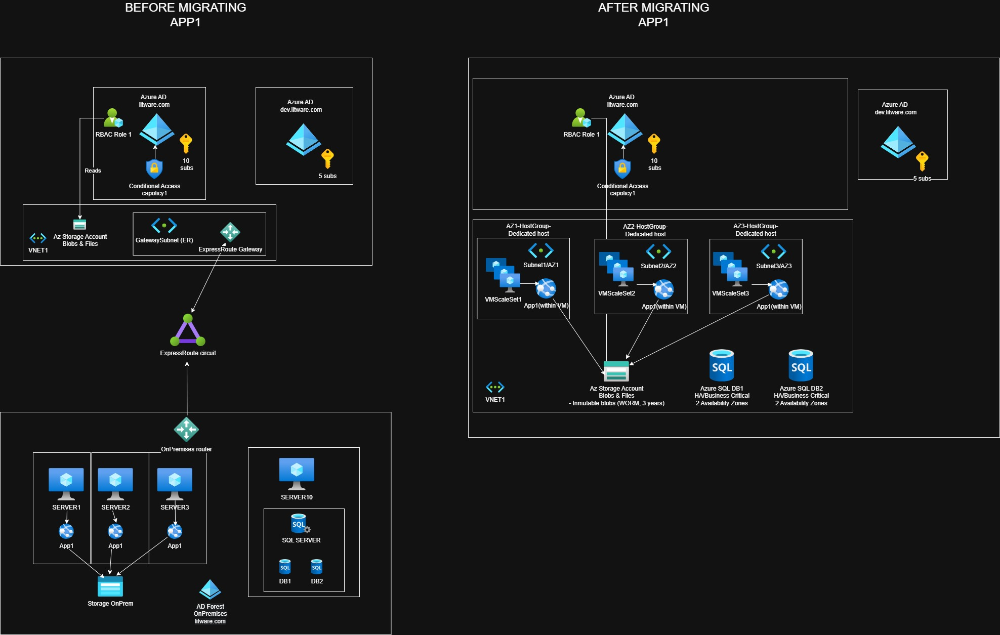

# Hybrid Migration – App1 (Azure Architecture Case Study)

## Overview

This case study describes the migration of a legacy, on-premises, multi-tier application (**App1**) to Microsoft Azure.  
The objective is to design a **secure, highly available, compliant, and cost-efficient Azure architecture**, following enterprise and regulatory constraints.

The scenario is based on a realistic hybrid environment and mirrors the type of architectural challenges found in regulated industries such as finance.

This repository contains:
- The **BEFORE** and **AFTER** architecture diagrams
- A clear explanation of requirements
- The resulting Azure target architecture
- A separate document detailing architectural decisions and trade-offs

---

## Company Context

**Litware, Inc.**
- Medium-sized finance company
- Headquarters in Boston
- Strict security, compliance, and availability requirements

---

## Existing Environment (Before Migration)

### Identity
- On-premises **Active Directory forest**: `litware.com`
- Azure AD tenant: `litware.com` (production)
- Secondary Azure AD tenant: `dev.litware.com` (development)
- Azure AD Premium P2 licenses
- Conditional Access policy enforcing:
  - Hybrid Azure AD-joined devices
  - Azure MFA for production access

### On-Premises Infrastructure
- **SERVER1–3** (Ubuntu 18.04 on Hyper-V)
  - Host third-party application **App1**
  - Use external Hadoop-compatible storage
  - POSIX ACL-based file permissions
- **SERVER10** (Windows Server 2016)
  - Microsoft SQL Server
  - Databases: `DB1` and `DB2`

### Networking
- ExpressRoute connectivity to Azure
- Single on-premises routing device

---

## Planned Migration Scope

The migration includes:
- Migrating **App1** to Azure Virtual Machines
- Migrating **DB1** and **DB2** to Azure SQL (PaaS)
- Migrating external storage to **Azure Storage**
- Deploying App1 on **dedicated hosts**
- Enforcing centralized RBAC and managed identities
- Applying security, compliance, and resiliency controls

---

## Key Requirements

### Security & Identity
- Azure MFA enforced
- Conditional Access for production subscriptions
- RBAC applied at management group level
- Managed Identity used for App1 resource access
- No public access to Azure Storage
- Azure SQL with Transparent Data Encryption (TDE)

### Resiliency
- Azure region supporting Availability Zones
- App1 must survive the loss of two availability zones
- Automatic failover
- Minimized I/O latency

### Compliance
- Data immutability for 3 years
- No public endpoints for storage
- Dedicated hosts (no shared physical infrastructure)

### Business
- Minimize administrative effort
- Minimize cost where possible without violating requirements

---

## Target Architecture (After Migration)

### Compute
- Azure Virtual Machine Scale Sets
- Deployed across **three Availability Zones**
- Hosted on **Dedicated Hosts**
- Automatic scaling enabled

### Data
- Azure SQL Database:
  - `DB1` and `DB2` migrated as **separate PaaS databases**
  - Business Critical tier
  - Zone-redundant configuration
- Azure Storage Account:
  - Blob storage with **immutable policies (WORM, 3 years)**
  - Private access only

### Identity & Access
- Azure AD (production tenant)
- Conditional Access policies enforced
- Custom RBAC roles applied at management group scope
- System-assigned Managed Identity used by App1

---

## Architecture Diagrams

### Before Migration

### After Migration

*(The Draw.io source is included for further inspection and iteration.)*

---

## Why This Case Study Matters

This project demonstrates:
- Hybrid cloud design
- Enterprise-grade Azure architecture
- Security-first decision making
- Trade-offs between IaaS and PaaS
- Practical application of Azure Well-Architected Framework pillars

This repository is intended as a **portfolio artifact** showcasing architectural thinking rather than an exam-only solution.
