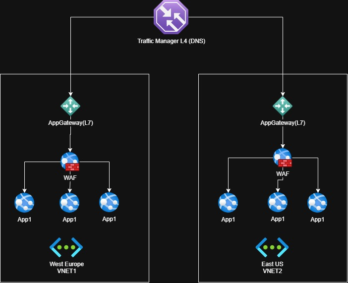

# Multi-region App Service – App1 (Azure Architecture Case Study)

## Overview

This case study describes a **multi-region web application** deployment on Azure designed for:
- Low latency for globally distributed users
- Resilience to regional outages
- Layer-7 security and traffic inspection at the edge of each region

The architecture uses **DNS-based global routing** and **regional L7 ingress** to keep the design simple, portable, and aligned with common enterprise patterns.

This folder contains:
- The architecture diagram (`.jpg`)
- The editable Draw.io source (`.drawio`)
- A `decisions.md` document with the Architecture Decision Records (ADRs)

---

## Target Architecture Summary

### Global Entry
- **Azure Traffic Manager** (DNS-based routing) distributes user traffic across regions based on health and routing policy.

### Per-region Ingress
- **Azure Application Gateway (v2)** provides L7 reverse proxying and routing.
- **WAF** is enabled to protect against common web attacks and enforce security rules.

### Application Tier
- **App1** runs in each region with multiple instances to scale horizontally.

> Note: The data layer and state management strategy are not shown in the diagram; ADRs cover the key constraints required for multi-region correctness (statelessness, externalized state, and failover behavior).

---

## Architecture Diagram

For design rationale and trade-offs, see **decisions.md**.
