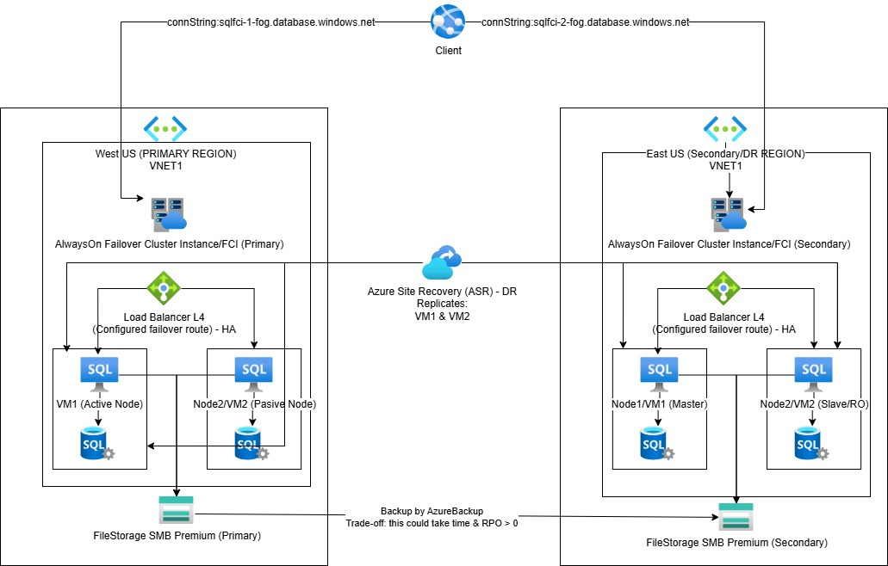

# SQL Server Lift & Shift to Azure (IaaS) – HA & DR Architecture

## Overview

This case study describes the **lift-and-shift migration of a mission-critical SQL Server workload**
from an on-premises datacenter to **Microsoft Azure using pure IaaS**.

The goal is to preserve **maximum compatibility with the existing SQL Server architecture**
while introducing **high availability (HA)** and **disaster recovery (DR)** capabilities
aligned with Azure best practices.

This architecture intentionally avoids PaaS refactoring and focuses on:
- Minimal application and database changes
- Full control over the operating system
- Enterprise-grade availability and recoverability

---

## Business Context

**Company:** Contoso Finance  
**Industry:** Financial Services  
**Workload:** Core transactional SQL Server database  
**Criticality:** Tier-1 system (24/7 operations)

The application is tightly coupled to:
- SQL Server Failover Cluster Instance (FCI)
- Windows Server Failover Clustering (WSFC)
- SMB-based shared storage

A full PaaS refactor was not viable due to:
- Legacy dependencies
- Third-party agents installed at OS level
- Strict change management policies

---

## Key Requirements

### Availability
- High availability within a single Azure region
- Automatic failover between SQL nodes
- No data loss within the region (HA)

### Disaster Recovery
- Ability to recover from a **full regional outage**
- Secondary region available for DR
- RPO > 0 accepted
- RTO measured in tens of minutes, not seconds

### Architecture Constraints
- Lift-and-shift (IaaS only)
- SQL Server Failover Cluster Instance (FCI)
- No application changes
- Full OS-level access

---

## Target Architecture Summary

### Primary Region (West US)
- Azure Virtual Network
- SQL Server FCI with:
  - 2 Windows VMs (active/passive)
  - Shared **Azure FileStorage Premium (SMB)**
- Azure Load Balancer (L4) for client connectivity
- Availability Set or Availability Zones for intra-region HA

### Secondary Region (East US)
- Azure Virtual Network
- Identical FCI topology (cold standby)
- Independent FileStorage Premium
- Azure Site Recovery (ASR) used for VM replication

### Disaster Recovery Mechanism
- Azure Site Recovery replicates SQL VMs
- Storage is recovered via Azure Backup
- Cluster is rebuilt during DR activation

---

## Architecture Diagram

---

## What This Case Study Demonstrates

- Correct use of SQL Server FCI in Azure
- Clear separation between **HA (intra-region)** and **DR (inter-region)**
- Understanding of Azure storage limitations
- Real-world trade-offs of lift-and-shift migrations
- Architect-level decision making, not exam shortcuts

For detailed design decisions and trade-offs, see **decisions.md**.
